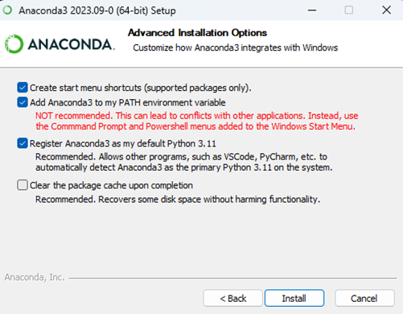
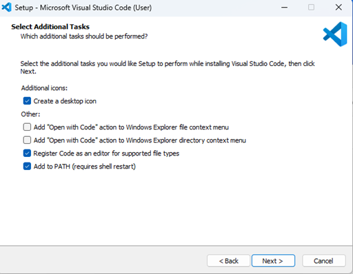
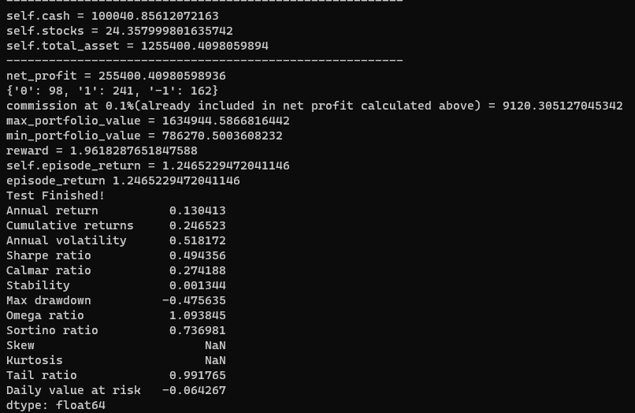

# Alpha Algo Team_99

## Name
ZeltaLabs CryptoAlgorithm Challenge: Untrade Cryptocurrency – Deep Reinforcement Learning Approach<br>
Main Report : [Final Report](finalreport.pdf)

## Description
In this project, we aim to develop and implement a crypto trading system using reinforcement learning techniques. Cryptocurrency markets are known for their volatility, making them an interesting domain for applying machine learning models to make informed trading decisions. Deep reinforcement learning, a subset of machine learning, provides a powerful framework for creating adaptive and self-learning trading algorithms.

Some important terminologies used:

- **Technical Indicators** [(i)](https://coinmarketcap.com/academy/glossary/), [(ii)](https://www.bitdegree.org/crypto/learn/crypto-terms/what-are-technical-indicators)
- **Hyperparameter tunning :** [(i)](https://www.geeksforgeeks.org/hyperparameter-tuning/)

The project can be more flexible by adding some of the more good features for some processes like:
Optimization can be focused to enhance the performance,speed and scalability of crypto currency.More optimizations to current codebase can be done.
More algorithm can be added in the codebase to make the agent mode enhanced to the volability of the market.
Embark on a journey of unparalleled flexibility and innovation with our ZeltaLabs CryptoAlgorithm Challenge. Here, algorithm design is a canvas for boundless creativity, pushing the limits to deliver standout solutions for the dynamic Untrade cryptocurrency. Beyond collaboration, we invite you to contribute to the core of our project by focusing on continuous optimization enhancing performance, speed, and scalability to unprecedented levels. Diverse algorithms enrich the agent mode, making it more adaptable to market volatility. Experience a transparent development process, participate in responsive community support. Join us in shaping the future, where flexibility meets excellence in Untrade cryptocurrency algorithms.


## Visuals
<p align="center">
 <video src="./Media/videoplay.mp4" controls title="Title"></video>
</p>
<p> Testing the model</p>


## Installation
1.  Download link for[ VSCode (for windows)](https://code.visualstudio.com/Download) and [Anaconda](https://www.anaconda.com/download)

3.  Install Anaconda by following the default steps: (**Select Add Anaconda3 to PATH environment variable**)
  <p align="center">
    
  </p>
  

4.  Install VS Code with the default settings.
  <p align="center">
    
  </p>
<!-- #where zelta is virtual environment name
         Enter "y" when asked ``` -->

5. Open Anaconda prompt and enter commands sequentially:
    ```bash
    # Create a Conda environment named "zelta" with Python 3.10.10 and the Anaconda distribution
    conda create -n zelta python=3.10.10 anaconda

    # Activate the "zelta" environment
    conda activate zelta 

    # Install the ta-lib package from the conda-forge channel
    conda install -c conda-forge ta-lib 
    ```
<!-- 5. Now open Anaconda prompt and enter commands sequentially:

 	    ```cmd
        conda create -n zelta python=3.10.10 anaconda
        conda activate zelta 
        conda install -c conda-forge ta-lib 
      ```
        Enter "y" when asked -->
  - Download this repository zip folder.
  - Extract the zip file in the current working directory.
      ```
        cd Zelta-Final
        code .
      ```  
  - Install the suggested Jupyter and python extensions.
  - Select python environment and then select the virtual environment `zelta`.
    ```bash 
        # Run the below commands in anaconda prompt
        pip install shimmy==0.2.1 
        pip install tensorboard 
    ```
6.  Open the file `dependencies.ipynb` 
    - Run the cells inside **Installing Dependencies** section
    - Run the **test section** (uses pretrained model saved in `./models`)

7. Observe the backtesting results by running *Backtesting Section*


**Note 1:**- Since the particular task cannot been ran on colab as there are some dependencies clash which cannot be resolved so the creation of virtual environment ensures that no such clash happens on local system. \
**Note 2:** Final results of our testing are present in `final results` folder.
## Usage
<p align="center"> </p>
<p>Testing Results Screenshot for model performance</p>

## Roadmap
Envisioning the future of our project, we are introducing an enhancement known as the EnsembleRL Agent. This improvised addition to our system aims to enhance the training process by employing a collaborative approach, where multiple models work synergistically to enhance predictive capabilities.

In the dynamic landscape of volatile timeframes, certain models may exhibit fluctuations in performance. The Ensemble Agent acts as a safeguard, ensuring optimal results by dynamically selecting the most effective model for a particular timeframe. This adaptive mechanism not only mitigates the impact of potential outliers but also maximizes the overall accuracy and reliability of our system.

The Ensemble Agent operates on the principle of collective intelligence, leveraging the strengths of diverse models to create a unified, resilient predictive framework. Through continuous learning and real-time evaluation, it identifies and utilizes the model that is most proficient in capturing the nuances of specific temporal patterns, thereby elevating the quality of output.

By incorporating the Ensemble Agent, our project not only embraces the forefront of technological innovation but also establishes a robust foundation for adapting to the ever-evolving challenges of the future. This forward-looking extension underscores our commitment to delivering consistently superior results in the face of dynamic and unpredictable conditions.


## Authors and acknowledgment
**Team_99**

We extend our heartfelt gratitude to Zelta Labs Untrade for providing us with a remarkable opportunity to work on algorithmic trading through their thought-provoking problem statement. This project has not only expanded our skills but has also deepened our understanding of the intricacies of algorithmic trading.

A special thanks goes to the vibrant and supportive community on the Zelta Labs Discord channel. Your wealth of knowledge, valuable advice, and continuous encouragement have been instrumental in guiding us through the challenges and helping us successfully complete our task. The collaborative spirit within the community has made this journey an enriching and rewarding experience.

Thank you, 
Zelta Labs Untrade, and the entire Discord community, for your generosity, support, and the opportunities to learn and grow in the fascinating world of algorithmic trading.


## Project status
The current model can be extended by ensemble agent and making risk management can be improved using that model the modification can be made in future to optimise the model and more efficient.

Note: If any issue arises and cannot be resolved please mail to this id: team99.interiit@gmail.com
